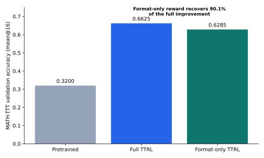

# Where Do TTRL Self-Improvement Gains Come From?

An empirical study of performance gains and evaluator-format bias in test-time reinforcement learning.

[中文说明](README_zh.md) · [Experiments](docs/EXPERIMENTS.md) · [Findings](docs/FINDINGS.md) · [Scope](docs/LIMITATIONS.md)

## Research question

TTRL uses majority-vote pseudo-labels to update a language model at test time. This repository asks what the resulting benchmark gain reflects: improved mathematical reasoning, or better adaptation between model outputs and the answer extractor used by the verifier.

We isolate the format component with a counterfactual reward. The standard reward gives one to an answer that matches the pseudo-label. The format-only reward gives one whenever the response contains an extractable `\\boxed{...}` answer, even when that answer is incorrect.

## Main finding

In the recovered Qwen2.5-Math-1.5B / MATH-TTT setting, format-only training reached **0.6285** validation accuracy. The corresponding starting value was approximately **0.3200**, while full TTRL reached **0.6625**.

```text
Recovered gain = (0.6285 - 0.3200) / (0.6625 - 0.3200) = 90.1%
```

Approximately 90% of the measured improvement is associated with format-bias correction in this setting. At step 150, the preserved run reports a training score and format score of 0.972 while answer accuracy is 0.628, confirming that the intervention optimized format compliance rather than answer correctness.

| Setting | Reward | MATH-TTT accuracy (`mean@16`) |
|---|---|---:|
| Pretrained | none | ~0.3200 |
| Full TTRL | pseudo-label match | 0.6625 |
| TTRL format ablation | format only | 0.6285 |



The instruction-tuned control shows the complementary pattern. In preserved co-validation exports, Qwen2.5-Math-1.5B improves from 0.322688 to 0.669312, whereas Qwen2.5-Math-1.5B-Instruct moves from 0.750469 to 0.758813. The model that already follows the expected output format shows a much smaller change.

## Contributions

- Reproduced and debugged TTRL on top of veRL and vLLM.
- Added co-validation instrumentation for pre/post-training comparisons, temperature sweeps, response length and majority-vote behavior.
- Designed and ran a format-only reward intervention that separates evaluator compatibility from answer correctness.
- Evaluated three primary model configurations across MATH-500/MATH-TTT, AMC and AIME, with an exploratory CommonsenseQA extension.
- Released scripts that regenerate compact result tables and the main figure from preserved logs and co-validation exports.

## Repository map

```text
examples/ttrl/                         experiment launchers
verl/trainer/ppo/ttrl_utils.py         pseudo-label and TTRL metrics
verl/trainer/ppo/ray_trainer.py        co-validation instrumentation
verl/utils/reward_score/ttrl_math/     grading and reward-mode intervention
analysis/                              table and figure generation
results/                               compact recovered results
docs/                                  experiments, findings and scope
```

## Installation

The experiments were run in the environment captured by `environment.yml`, with Python 3.10, PyTorch, veRL and vLLM:

```bash
conda env create -f environment.yml
conda activate ttrl
```

For veRL's current installation alternatives, see the retained upstream documentation under `docs/`.

## Run the reward ablation

Standard TTRL reward:

```bash
bash examples/ttrl/run_reward_ablation.sh \
  accuracy \
  examples/ttrl/Qwen2.5-Math/math.sh
```

Format-only reward:

```bash
bash examples/ttrl/run_reward_ablation.sh \
  format_only \
  examples/ttrl/Qwen2.5-Math/math.sh
```

The wrapper forwards extra Hydra overrides to the selected experiment script. The underlying configuration is:

```yaml
custom_reward_function:
  path: ./verl/utils/reward_score/ttrl_math/__init__.py
  name: reward_func
  reward_kwargs:
    reward_mode: accuracy  # accuracy | format_only
```

## Reproduce tables and figures

```bash
python analysis/extract_training_metrics.py train.log \
  --output results/format_only_curve.csv

python analysis/summarize_covalidate.py \
  covalidate_preload.csv covalidate_loaded_step_150.csv \
  --output results/covalidate_recomputed.csv

python analysis/plot_ablation.py
```

See [the experiment guide](docs/EXPERIMENTS.md) for the experiment matrix and [the findings](docs/FINDINGS.md) for the evidence chain.

## Results and scope

The headline estimate is grounded in the preserved Qwen2.5-Math-1.5B format-only log and contemporaneous full-TTRL record. Llama-3.1 exhibited unstable dynamics in the recovered run. The next measurement is to repeat the explicit reward-mode intervention across seeds, extractors and the remaining datasets. Details are in [Scope and next measurements](docs/LIMITATIONS.md).

## Attribution

This project builds on [veRL](https://github.com/volcengine/verl) and the TTRL research implementation. The Apache-2.0 license and original notices are retained. Reconstruction sources and project-specific contributions are listed in [Provenance](docs/PROVENANCE.md).
